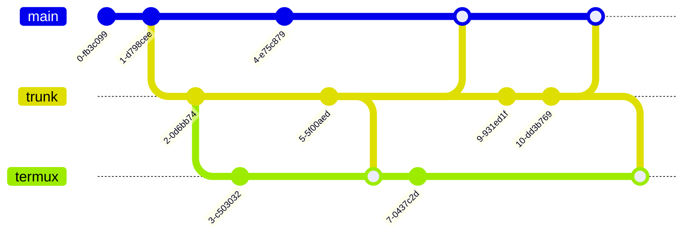

# Welcome to ~/.* managed with xadf (xeno authority dotfiles) !


My dotfiles repository, managed with [bare git and alias method](https://news.ycombinator.com/item?id=11071754), implemented as a custom controller script ([`xadf`](.local/bin/xadf)) that also function as a standalone installation script to replicate my dotfiles configuration to any unix home directory with bash.
Also features a number of custom bash functions (the [`$xadfmods`](.local/xadf/)) either for my use or just for fun.

[TOC]

> **Note for forkers:** It is not recommended to use my setup right away. You should at least inspect the scripts and configuration files of my setup. Maybe you'd be more interested in the main `xadf` script, how it manages dotfiles at home directory, what to change if you're forking this repository (or `xadf` specifically) or its installation steps.
> 
> In that case you may wish to jump to [Code Design of xadf](#code-design-of-xadf) for an overview of `xadf` code structure, [Installation](#installation-of-xadf) on how to install `xadf` and use it to manage your dotfiles with git, or even reading through `xadf`'s [technical specifications](#implementing-bare-git-with-alias-method-as-a-helper-script).

# Introduction

I've been looking for a way to conveniently manage my dotfiles with git version control. The question remains on how to properly do it? The options are either using [stow](https://brandon.invergo.net/news/2012-05-26-using-gnu-stow-to-manage-your-dotfiles.html), or bare git and alias method (see [archlinux wiki page on dotfiles](https://wiki.archlinux.org/title/Dotfiles)).

After testing the `stow` method, I concluded that it provides only marginal improvements at the expense of symlinking in home directory and complicated setup (manually copy config files and recreate the directory tree for each stow packages). The bare git and alias method seems simpler, directly work at home directory instead of a separate folder, avoids symlinking, and we can selectively decide which file to track. [The set up](https://gitlab.com/Siilwyn/my-dotfiles/tree/master/.my-dotfiles) seems to be simpler too.

However the problem remains on how to include [`LICENSE`](./LICENSE) and `README.md` at the root of repository but not in our actual home folder. It is trivial with `stow` method, where we just place them in the root of the repository, while each folder represents stow packages. With git, we have to use smart branch hacks to hide `LICENSE` and `README.md` from our actual home directory.

The following sections will describe basic idea of how to set up bare git and alias method, how to deal with `LICENSE` and `README.md`, and my actual implementation of bare git and alias method.

# Manage Dotfiles with Bare Git and Alias Method - Basic Idea

Basically, to manage dotfiles with git bare methods, we have to set up a bare repository, and use a different work-tree. Then to replicate it, we clone with `--separate-git-dir` argument to a temporary directory. Then we rsync (except for `.git` folder) to home directory, and later remove the temporary directory.

## Setup

The basic idea is to initialize a bare git repository over an existing (or fresh) home directory, then set up an alias (ideally add them to `.bashrc` or `.bash_aliases`), and add a remote for us to push to.

```bash
git init --bare $HOME/xadf
alias xadf='git --git-dir=$HOME/xadf/ --work-tree=$HOME'
xadf remote add origin git@gitlab.com:heno72/xadf.git
```

## Replication

If the repository is already been set up, we can just clone the repo with separate git directory. Initially, we will need to clone the work tree to a temporary directory, and then sync the content of the temporary directory to our home directory. Later we can just delete the temporary directory.

```bash
git clone --separate-git-dir=$HOME/xadf https://gitlab.com/heno72/xadf.git .xadf-tmp
rsync --recursive --verbose --exclude '.git' .xadf-tmp/ $HOME/
rm --recursive .xadf-tmp
```

## Configuration

Since there would be a ton of files in a real home directory, having them shown all the time will be a nuisance and a straightforward distraction. Here we configure git to not show untracked files.

Additionally, since we are cloning from git https clone url, we may need to change to git ssh clone url. Otherwise we will have to type our credentials on every push operation. Make sure to set up ssh keys on the machine and add it to your git account beforehand.

```bash
xadf config status.showUntrackedFiles no
xadf remote set-url origin git@gitlab.com:heno72/xadf-gb.git
```

## Usage

After setting up, we can just use the alias to substitute `git` command in our home directory. We can use it like any normal git command. Therefore eliminating collision with real git repository under home. Also typical `git` commands would not work at our home root since it does not contain `~/.git` directory.

```bash
xadf status
xadf add .gitconfig
xadf commit -m 'Add gitconfig'
xadf push
```

## Dealing with repository meta files

A `README.md` is very helpful to document the usage of our repository, and a `LICENSE` will also clarify the terms of use of our repository. An additional `docs/` folder might be necessary to document a more elaborate use case of our setup. However we may not want to have those files and directories in our real home folder. [This answer](https://stackoverflow.com/a/62614921/12571203) actually provide a gist of how to do it, but I accidentally reinvent that in a spur of inspiration:

1. First initiate a git repo for xadf and make initial commits without readme and/or license.
2. Then we make a branch, say, branch `trunk`.
3. Then in branch `master`, adds readme and license.
4. Afterwards, changes to config files are done or branched from branch `trunk` only. Then branch `trunk` may be merged to `master` often. But never the other way around (from production, merge master).

As long as we work with the `trunk` branch and never merge `master` there, we will be okay. Additionally, more branches can be added from branch `trunk` (and not `master`). Further changes of `trunk` can be merged to any subsequent branches. Likewise, if so desired, any other branches but `master` can be merged to `trunk`.

Though, honestly I would advise to make shared configs on `trunk` and later merge them to other branches and branch `master`.

Therefore, we can visualize the branching and merging direction like this:


> only merge `trunk` to `master`, `termux`, or `laptop`, or from `termux` or `laptop` to `trunk`, but never merge `master` to `trunk`.

A more complicated tree is actually possible:


Example git history looks like the following:



> Notice that all branches (including main) merge trunk to them, but not the other way around. That way you can place common configurations in branch `trunk`, and you merge them to machine-specific or setup-specific branches frequently.

# Implementing Bare Git with Alias method as a helper script

Instead of just using alias, and do all of the steps described in previous section manually, I want to have them be done automatically with a script. The goal is to have a single script that will handle installation (cloning repo with separate git directory, checking out to correct branch, syncing repo contents to home directory, set up helper configuration files so we can use the tool on the next login or new terminal sessions), and can function as an alias to git with separate git directory (essentially an alias for `git --git-dir=$xadfdir --work-tree=$HOME`, where `$xadfdir` is declared in the aforementioned helper configuration file) for day to day use.

Since I already have working `.bashrc` configurations in most of my machines and setups (especially my android's termux), I want the mechanism to be minimally invasive to `.bashrc`. We could later decide to track `.bashrc` in separate machine-specific branches, or the produced configuration files in `~/.config/xadf` (`$xadfconfig`) if necessary. We should also distinguish `.local` and `.config` use. I want `.local` to be used to store custom functions and and templates, while `.config` folder to specifically store `xadf` related configurations, or configuration files of custom functions or custom scripts shipped with `xadf` in `~/.local/{bin,xadf}`

The following subsections will outline the basic directory structures, specification of configuration files and config constructor files, and specification of `xadf` itself. We will also outline installation, uninstallation, and usage.

## xadf Directory Structure

A minimal `xadf` would inhabit the following locations, and be populated with the following files:

```
# Relative to $HOME/
xadf/              # the default git directory for xadf, configurable on install
                   # xadf will declare it as $xadfdir
.local/
  bin/             # xadfrc will add this as $PATH
    xadf           # a helper script and an alias of git commands
  xadf/            # xadfrc will declare it as $xadfmods
    templates/     # especially useful for constructor functions
      default-recipe.txt
      template-xadfrc
    bash_aliases   # common aliases for our use
    bash_functions # common functions for our use
    <other custom modules and functions>
.config/
  xadf/            # xadfrc will declare it as $xadfconfig
    xadfrc         # formerly head.sh, sourced from .bashrc
    recipe.txt     # to determine which modules from $xadfmods to load
README.md          # this file                         (only present in branch master)
LICENSE            # our license file, currently GPLv3 (only present in branch master)
```

There will obviously be other configuration files for other apps, but the above directory structure is the most relevant for `xadf` script.

The configuration files in `.config/xadf/` will ensure that on login, or in a new shell session, the following steps will be run:

```
~/.bashrc
   > loads ~/.config/xadf/xadfrc
~/.config/xadf/xadfrc
   > ensures ~/.local/bin is in the $PATH
   > defines xadfconfig="$HOME/.config/xadf"
   > defines xadfmods="$HOME/.local/share/xadf"
   > defines xadfdir="$HOME/xadf/" # configurable by xadf during install
   > if no $xadfconfig/recipe.txt, calls `xadf --build-recipe`
   > else sources $xadfconfig/recipe.txt
~/.config/xadf/recipe.txt
   > if present, sources $xadfmods/bash_aliases
   > if present, sources $xadfmods/bash_functions
```

Therefore the most important parts of a minimal `xadf` environment are:

- a properly configured `~/.bashrc`
- a valid `~/.config/xadf/xadfrc` configuration
- an usable `~/.config/xadf/recipe.txt`

## Technical Specification of xadfrc

```
File     : xadfrc
Location : ~/.config/xadf/
```

**Description:** An init script supposed to be called from `.bashrc`, and performs the following actions:

1. ensures `~/.local/bin` is in the `$PATH`
2. defines `xadfconfig="$HOME/.config/xadf"`
3. defines `xadfmods="$HOME/.local/share/xadf"`
4. defines `xadfdir="$HOME/xadf/"`, configurable with `xadf --seat DIR` during installation
5. if `$xadfconfig/recipe.txt` is absent, calls `xadf --build-recipe`
6. else sources `$xadfconfig/recipe.txt`

```
File     : template-xadfrc
Location : ~/.local/xadf/templates/
```

**Description:** Not exactly `xadfrc`, but a template to be called by `xadf` script and produces `xadfrc`. It is almost identical with `xadfrc` except `$` sign is carefully escaped. For `$xadfdir` definition, it would come with a template or pattern that can be parsed by `xadf` to produce correct git directory of the dotfiles repo.

On parsing `template-xadfrc`, we can escape all `$` in the file, prepend and append `CAT <<EOF` and `EOF` to the template text, and then source it from terminal (or script) while piping it to `sed`. For example:

```bash
~$ . template-xadfrc|sed "s#$HOME#$\HOME#"
```

The `sed` command must use double quotes instead of single quotes so the `$HOME` part will undergo string expansion, before we substitute the string. Therefore the value of `$HOME` (eg. /home/username/) will be replaced with literal string `$HOME`.

## Technical Specification of recipe.txt

```
File     : recipe.txt
Location : ~/.config/xadf/
```

**Description:** A text file sourced by `xadfrc` during login or on a new terminal session, whose sole responsibility is to load select bash functions in `$xadfmods` directory. Must contain valid bash syntax.

It is automatically generated by `xadf` during install, or is reset when `xadf -r` is run, or is built from `default-recipe.txt`. Though later can be configured to load other modules in `$xadfmods`. Due to its nature on being sourced by `xadfrc` that is itself sourced from `.bashrc`, you can actually use it as an extension of `.bashrc`.

```
File     : default-recipe.txt
Location : ~/.local/xadf/templates/
```

The content of `$xadfmods/templates/default-recipe.txt` that is used to build default `recipe.txt` should at least performs the following actions:

1. if present, sources `$xadfmods/bash_aliases`
2. if present, sources `$xadfmods/bash_functions`

## Technical Specification of xadf

### Summary

This is essentially our dotfiles repo controller. It can also function as an installer script: downloading the entire repo, sets up alias, append source directive to .bashrc, and syncs all contents from dotfiles to `$HOME`. When called, it can also function as an alias for git with separate home dir, where the git directory is set at either `$HOME/xadf` or somewhere that is specified with `--seat` at install time.

**Program:** `xadf`

**Description:** A bash script to control and manage dotfiles in a home folder with bare git methods. When called without its native arguments, act as an alias of `git --git-dir=$xadfdir --work-tree=$HOME`

> **WARNING:** By default, it will sync all contents of the repository (obviously excluding `.git`) to `$HOME`. If it is undesirable, back up your files when necessary, or comment out the rsync command from `xadf` script directly.

### Options

The following are its native options:

**-r / --build-recipe**

: produce `$xadfconfig/recipe.txt` by copying `$xadfmods/default-recipe.txt`

**-x / --build-xadfrc**

: produce `$xadfconfig/xadfrc` by constructing from `$xadfmods/template-xadfrc`

**-l / --list-tracked**

: lists tracked file, an alias of `xadf ls-tree --full-tree -r --name-only HEAD "$@"`. May expect arguments in form of path relative to repository root. See README.md of dotfiles repo of alfunx. Note: it is ***MUTUALLY EXCLUSIVE WITH*** other options after this option.

**--heno**

: configures upstream link, essentially an alias for `xadf remote set-url origin git@gitlab.com:heno72/xadf.git` (for my personal needs, don't do that if you don't have write access there! If so desired, you can change the option or the url to your own).

**-v / --version**

: prints version and exit

**-h / --help**

: prints help and exit

Installation-specific options:

**-i / --install**

: function as an installer, and perform installation of xadf into user's `$HOME`, and building `xadfrc`. By default, configure xadf git directory in `$HOME/xadf`

**--seat DIR**

: configures xadf git directory to a custom location DIR instead of `$HOME/xadf` during install time. Is meant to be used in conjuction of option `-i / --install`

**-b NAME / --branch NAME**

: checks out to branch NAME. Without this argument, it is identical to call the program with option `--branch master`

### Installer

The use of `-i` option when executing `xadf` should perform the following actions:

1. Replicate from xadf git repository with separate git configuration. It will also specify a temporary location `$HOME/.xadf-tmp` to store all contents of the repo. If `--seat` is set, replicate git directory to the specified location. Otherwise, replicate git directory to `$HOME/xadf`
2. Switch working directory to `$HOME/.xadf-tmp`
3. If `--branch` is set, checks out to branch NAME
4. `rsync` all contents of `$HOME/.xadf-tmp/` except '.git' to `$HOME`
5. Return to `$HOME`
6. Removes `$HOME/.xadf-tmp/`
7. Make untracked files not shown. Equivalent to `xadf config status.showUntrackedFiles no`
8. Check if `.bashrc` exists. If exists, go to 10, else go to 9
9. Copy from `/etc/skel/.bashrc` to `~/.bashrc`, and continue to 10
10. If `.bashrc` does not contain `. $HOME/.config/xadf/xadfrc`, appends that line to the end of `~/.bashrc`. Note that it should at first strip all comments off by piping to sed (does not modify `.bashrc`) and then performs `grep` search.
11. Builds `xadfrc` from `$xadfmods/templates/template-xadfrc` (honors `--seat` option)
12. If `recipe.txt` is absent, builds `recipe.txt` from `$xadfmods/templates/default-recipe.txt`

# Code Design of xadf

Following the specifications of `xadf` and its supporting configurations, we can then outline how the code should be structured.

1. Define state variables:
   
   > **Note for forkers:** you may want to change the values of `xadf_https_repo` and `xadf_ssh_repo` to point to your forked repository instead of mine.

```bash
version=<version number> # (for use with --version)
is_heno=0
build_recipe=0
build_xadfrc=0
install_mode=0
install_seat="$HOME/xadf"
install_branch="trunk"
xadf_https_repo="https://gitlab.com/heno72/xadf.git"
xadf_ssh_repo="git@gitlab.com:heno72/xadf.git"
```

2. Define function `xadf_build_recipe()`

   > See [Technical specification of recipe.txt](#technical-specification-of-recipetxt)

   This function's sole purpose is to generate `recipe.txt` from our template. It does so by using program `cat`.

3. Define function `xadf_build_xadfrc()`

   > See [Technical specification of xadfrc](#technical-specification-of-xadfrc)

   This function's sole purpose is to generate a valid and usable `xadfrc` file to be sourced from `.bashrc`. The template will produce a valid `xadfrc` that points to the correct bare git repo directory (declare `$xadfdir`, however during installation it is the value of `xadf` internal variable `$install_seat`).

   It will display the `$xadfdir` in `$HOME/xadf` format instead of `/home/username/xadf` by the use of sed via pipeline:
   
   > `. ~/.local/xadf/templates/template-xadfrc | sed "s#$HOME#\$HOME#" > ~/.config/xadf/xadfrc`

4. Define function `xadf_install()`

   > See [Installer](#installer)

   This is by far the most complicated function of the code.
   For almost each steps it will test whether the action is completed succesfully.
   It will break when it encountered errors, and possibly clean up to not interfere up with future installation attempt.

5. Define function `xadf_version()`

   > Prints program name and version, then exit.

6. Define function `xadf_show_help()`

   > Runs `xadf -v`, then prints help text, then exit.

7. Parse options.
   
   Basic while loop that is true until is told to break, then arguments are passed via case conditionals.

   For option `-l / --list-tracked`, run: `xadf ls-tree --full-tree -r --name-only HEAD "$@"`. Note that it may also expect to be provided arguments, for example to specify which file or directory do we want to see (just like `ls` in some ways).

   For option `-h / --help`, runs `xadf_show_help()` and then exit.

   For option `-v / --version`, runs `xadf_version()` and then exit.

   For all other native `xadf` options, they will only be used to manipulate state variables.

   - `-i / --image` changes `install_mode=1`
   - `--seat` changes `$install_seat` to DIR
   - `-b / --branch` changes `$install_branch` to NAME
   - `-r / --build-recipe` changes `build_recipe=1`
   - `-x / --build-xadfrc` changes `build_xadfrc=1`
   - `--heno` changes `is_heno=1`

   When no native `xadf` options are provided, run: `git --git-dir="$xadfdir" --work-tree="$HOME" "$@"`. Note that it should fail if `$xadfdir` is not set (that is, no xadf installed yet). It will expect all arguments following it to be git arguments, so treat it just like you would a `git` command.

8. Main section

   Check state variables, and decide what function to call.

   1. if `install_mode=1`, then calls `xadf_install()`
   2. if `build_recipe=1`, then calls `xadf_build_recipe()`
   3. if `build_xadfrc=1`, then calls `xadf_build_xadfrc()`
   4. if `is_heno=1`, then runs `xadf remote set-url origin git@gitlab.com:heno72/xadf.git`

# Installation of xadf

> **Tip:** You may wish to [check dependencies](#dependencies-of-xadf) required to properly run xadf.

Download xadf script [here](https://gitlab.com/heno72/xadf/-/raw/master/.local/bin/xadf), then make it executable. Place it somewhere in your `$PATH`. Ideally save it as `$HOME/.local/bin/xadf` so it will be replaced with the latest version of `xadf` from our git repository.

```bash
# Download the script
wget -c https://gitlab.com/heno72/xadf/-/raw/master/.local/bin/xadf

# Make the script executable
chmod +x xadf

# Move to local bin directory, you may need to make it.
mv xadf ~/.local/bin/
```

If `$HOME/.local/bin/` is not in your path, you can actually run the following command:

```bash
PATH=~/.local/bin:$PATH
```

Then run:

```bash
xadf -i [--seat DIR] [--branch BRANCH] [--heno]
```

Option `--seat DIR` will change default git directory from `~/xadf` to DIR. DIR can be any directory under home of your choice, (eg. `~/.xadf` or `~/.dotfiles`).

Option `--branch BRANCH` will change checked out branch from default branch to branch BRANCH (of your choice). The branch must already exist in your repository.

As we are downloading from https git clone url, we must provide our credentials on every push. This is generally undesirable. Provided that we already set up ssh keys in our environment, we can use option `--heno` to change the link from https clone url to git ssh clone url.

If `xadfrc` is not created during installation, or if it is damaged at later date, you can use `xadf -x` or `xadf --build-xadfrc` to rebuild it. If you set up a custom git DIR with `--seat DIR`, then you may need to also supply it when building `xadfrc`, or else it would point to wrong `$xadfdir` location.

You can actually move the `$xadfdir` location from default `~/xadf` or any previously set directory (eg. moving it to `~/.dotfiles` or `~/.xadf`), and then update `xadfrc` with the following commands:

```bash
# Move git directory (eg. from ~/xadf to ~/.dotfiles)
mv ~/xadf ~/.dotfiles

# To prevent xadf from getting confused of previous xadf-specific environment variables
unset xadfdir

# Build xadfrc to use new git dir location
xadf --build-xadfrc --seat ~/.dotfiles
# or
xadf -x --seat ~/.dotfiles

# Source your .bashrc
. ~/.bashrc

# Check whether everything is succesfully configured or not
xadf status -sb
```

## Dependencies of xadf

`xadf` is nothing but a single executable bash script, and depends on a variety of programs installed in your environment. The following is a non-exahustive list of programs that you need to have installed before running the script:

- `bash` - GNU bash
- `cat` - GNU coreutils
- `sed` - GNU sed
- `git`
- `rm` - GNU coreutils
- `rsync`
- `realpath` - GNU coreutils
- `wget` - GNU Wget

# Uninstallation of xadf

In case we want to uninstall `xadf`, all we have to do is to remove:

```
.local/bin/xadf
.local/xadf/
.config/xadf/
```

Note that the above list is not comprehensive, and will only uninstall xadf and its helper resources. Configuration files of other programs will remain. It should be possible to delete every file git tracks in your home directory by piping `xadf -l` output to `xargs rm -rf`:

```bash
xadf -l | xargs rm -rf
```

Warning, do so at your own risk, and only if you know what you're doing.

And then remove a line in `~/.bashrc` that sources `~/.config/xadf/xadfrc`. Also do:

```bash
unset xadfconfig xadfmods xadfdir
```

It is required to unset those variables because it might interfere in the next attempt to install `xadf`

# Migrating from xadf v0

> **Note:** This section is for my personal use.

The `xadf v0` is actually my previous poor attempt to back up and manage dotfiles. I was having difficulties on setting up a repository, that I can pull into a new machine, and then use custom bash function `xadf()` to pull and update config files. Then I will have to manually sync the content of the repository into appropriate locations on my real home.

As you may have guessed, it is very easy for me to forget to actually edit inside xadf directory (a separate location from my actual dotfiles location), and sync to home directory. I ended up editing directly on my home directory, and syncing them one by one to the repository.

Because of the frustration on managing them in such a tedious workflow, I decided to research more on how to manage dotfiles. That brings us to the current incarnation of `xadf`.

However it is not entirely an useless experience for me. In fact because of the previous incarnation of `xadf`, I get the inspiration of the current `.bashrc > xadfrc > recipe.txt` (it was `.bashrc > head.sh > recipe.txt` in `xadf v0`).

## Brief differences between xadf v0 and current xadf script

`xadf v0` was designed to operate in a single location (designated `$xadf` directory) that will contain custom functions, extensions for bash aliases and bash functions, and other configuration files. Meanwhile in `xadf`, all the files are meant to reside direclty in user home directory.

Its installation is also similar. All we have to do is to clone the repository to any location we wish under `$HOME` (normally `~/Documents/xadf/`), change directory there, and run `xadf.sh`. It will generate `head.sh` and `recipe.txt` if they are not present already, and append a line in `~/.bashrc` to source `head.sh`. Then we manually sync the content of `config/` to `~/.config/` and the content of `local/` to `~/.local/`. That last step must be repeated on every update made in `config/` and `local/` under `$xadf/`.

| xadf v0 | current xadf | comment |
| :------ | :----------- | :------ |
| `$xadf/`                 | `~/`                        | Root directory of the repository |
| `$xadf/config/`          | `~/.config/`                | Previous `xadf v0` requires us to manually sync them with `~/.config/` |
| `$xadf/custom/`          | `~/.local/xadf/`            | Where we place `bash_functions`, `bash_aliases`, and various custom bash scripts. The `bash_function` file in `xadf v0` used to have a custom `xadf()` function to update `$xadf` directory with remote, or reload `head.sh`. |
| `$xadf/local/`           | `~/.local/`                 | Generally where we place binaries or shared files (for programs to use) |
| `$xadf/xadf.sh`          | `~/.local/bin/xadf`         | Not exactly a direct analog. In `xadf v0`, its responsibility is to generate `head.sh` and `recipe.txt`, while also appending a line in `.bashrc` to source `head.sh` if it is not present. Meanwhile the current incarnation manages everything from installing to day-to-day use. |
| `$xadf/head.sh`          | `~/.config/xadf/xadfrc`     | Manages xadf-specific variables, especially where it would look for configuration files. Also loads `recipe.txt` |
| `$xadf/recipe.txt`       | `~/.config/xadf/recipe.txt` | A definition file for what modules to load, also function as an extension of `.bashrc` |

One major difference of current incarnation of `xadf` with `xadf v0` is that configuration files in `$xadf/` is not the same as configuration files in `$HOME/`. This is not true with the current incarnation where the working directory of `xadf` repository is exactly `$HOME`.

Similar to the current incarnation, I designed `xadf v0` to be minimally invasive to the home directory. Meaning its entire life hangs on the existence of a line in `.bashrc` that loads `$xadf/head.sh`. It is useful for my case because it means all I have to do is simply to remove or comment out that line.

## Removing xadf v0

As described in the previous section, removing `xadf v0` should be fairly trivial and easy. Ideally it should also be done before installing `xadf` because of the existence of `xadf()` bash function in a system managed with `xadf v0`. We also want to do it in the most simplest and reproducible manner.

The exact actions that must be exactly followed are:

1. Comment out the line in `.bashrc` that sources `$xadf/head.sh`
2. Unset `xadf()` from your environment to not interfere with `~/.local/bin/xadf`

Hence the following oneliner:

```
sed -i 's_^source.*xadf/head\.sh._#&_' ~/.bashrc && unset -f xadf
```

The `sed` invocation search within `~/.bashrc` for a line that starts with `source`, then followed with anything, then also contain `xadf/head.sh` and one more character (I specifically searched for the ending `"`), then replace it with the string `# ` and all the matches (the regex pattern `&` does it). If it is successfully removed, it will unset function in your bash environment named `xadf`.

Afterwards you can safely remove `$xadf` if so desired:

```
rm -rf "$xadf"
```

That is the entire necessary steps required to remove `xadf v0`. You can then proceed to [install `xadf`](#installation-of-xadf).
